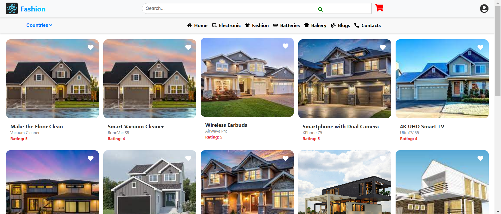
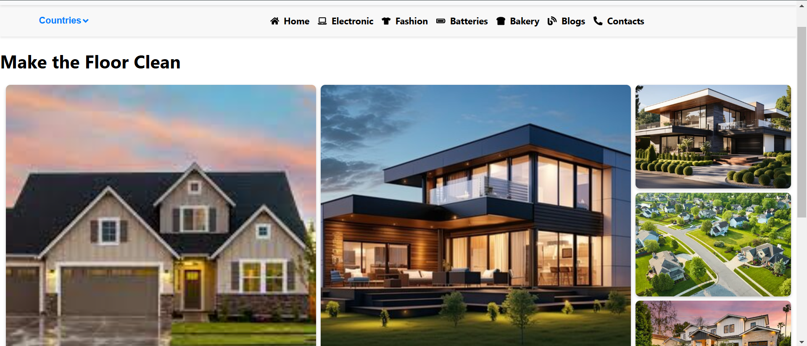
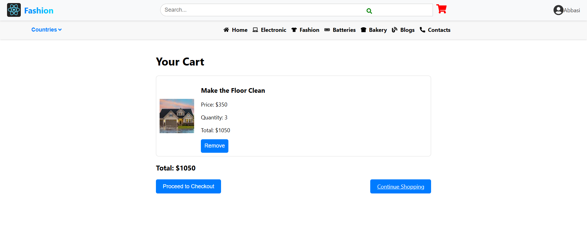

# 🏠 Housing Sales and Purchase

## 📊 Project Overview
This project is a platform for **buying and selling homes**. It allows users to browse listings, view details of homes, and manage their purchases. The website includes several pages like the **Home Page**, **Details Page**, and **Cart Page**.

---

## 🚀 Features
- **Home Page**: Browse a list of homes for sale, featuring images, titles, and prices.
- **Details Page**: View detailed information about each property.
- **Cart Page**: Add homes to your cart for purchase and manage your selected properties.

---

## 🖼️ Screenshots

### 🏠 Home Page


The **Home Page** displays a list of properties for sale, each with a title, price, and image.

### 📋 Details Page


The **Details Page** shows more detailed information about a property, including high-resolution images and in-depth descriptions.

### 🛒 Cart Page


The **Cart Page** allows users to review and manage their selected properties, with the option to proceed to purchase.

---

## ⚙️ How It Works
1. **Home Page**: Users can browse the list of available properties for sale.
2. **Details Page**: Clicking on a property opens detailed information, including images and descriptions.
3. **Cart Page**: Users can add properties to their cart and proceed with the purchase.
4. **Checkout**: Once ready, users can finalize their purchase from the cart.

Make sure that both the front-end and back-end folders contain only the code files of project. but to run this, you have to install the node-modules in order to run it. in frontend, install node modules of react and in backend install node modules of express.js.
---

## 🛠️ Technologies Used
- **Frontend**: React
- **Backend**: Node.js, Express
- **Database**: MongoDB
- **Deployment**: (Include deployment details like Heroku, Netlify, etc.)

---

## 🏁 Getting Started
1. Clone the repository:
   ```bash
   git clone https://github.com/yourusername/housing-sales-purchase.git
